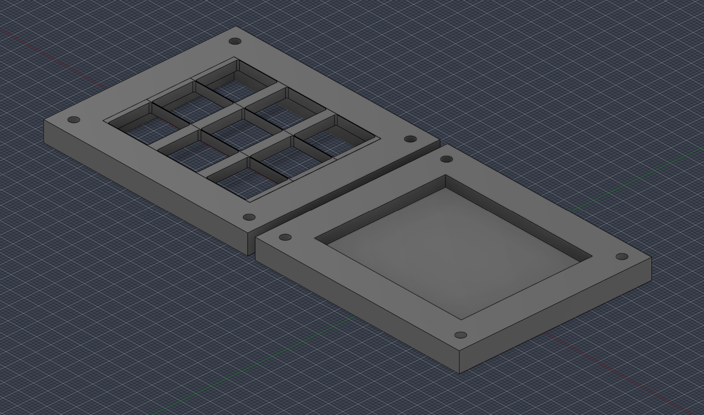
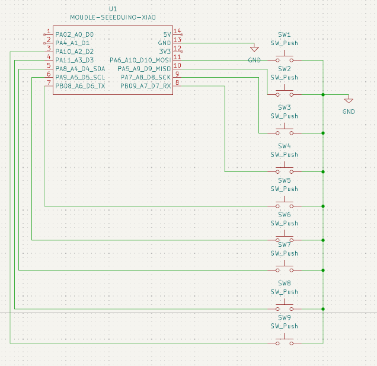
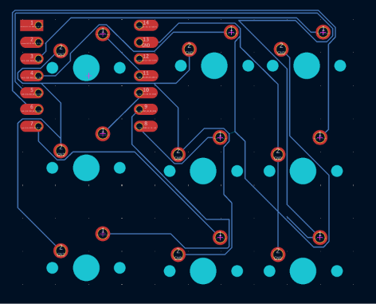
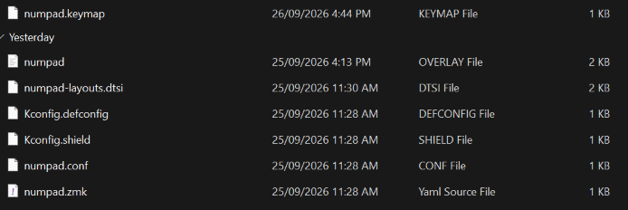

# NumPad

NumPad is a simple 9 key Macropad that uses ZMK firmware.

## CAD Model:

The two case parts are to be gluded together using an epoxy or plastic glue.

The bottom part is where the pcb will sit while the top is where the keys will sit.

## 

## PCB:

Here's my PCB which was made in kiCad.

Schematic:

PCB:

## Firmware:

This hackpad uses ZMK firmware with the simple 9 keys set to 1-9

## BOM:

Heres (hopefully) everything you would need to make this hackpad

* 9x keyboard swithes
* 9x keycaps
* 1x Seeed Studio XIAO (SAMD21)
* 1x case

## Extra notes:

Sorry if this isn't perfect as its my first project but it should work pretty well (I hope).

